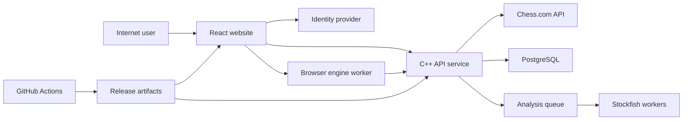

# Plywise Threat Model

## Executive summary

Plywise is safe today only as a loopback, single-user application. The web target adds untrusted
anonymous clients, accounts, PostgreSQL, browser-supplied Stockfish observations, and optional
shared engine workers. The highest-risk release failures are exposing the current unauthenticated
API, missing owner predicates on records or WebSocket events, accepting forged browser analysis as
canonical truth, and allowing imports or analysis jobs to exhaust shared compute. Authentication,
owner-scoped repository contracts, C++ validation, admission limits, and privacy deletion are Phase
1/2 release gates rather than later hardening.

## Scope and assumptions

In scope:

- target web architecture in `ground-truth/WEB_ARCHITECTURE.md` and
  `ground-truth/SYSTEM_ARCHITECTURE.md`;
- current runtime entry points in `src/main.cpp`, `src/service/http_server.cpp`, and `web/src/api.ts`;
- chess import, parsing, Stockfish, job, repository, and event-log boundaries under `src/` and
  `include/pct/`;
- build and release workflows under `.github/workflows/`;
- planned browser worker, managed auth, PostgreSQL, and optional server-worker boundaries.

Out of scope:

- payment processing, because no paid phase is committed;
- the blocked browser extension implementation;
- security of Chess.com, a managed identity provider, hosting vendor, or browser itself;
- local attackers who already control the user's OS and data directory;
- cryptographic review of TLS, JWT, PostgreSQL, or Stockfish implementations supplied by vendors.

Assumptions:

- the first hosted alpha is public-internet reachable but invite-only and small;
- anonymous users may run one completed-game review, while accounts save history;
- email, PGN, review, practice, and intelligence records are private data;
- no payment or government identity data is collected;
- managed authentication stores passwords and the C++ service validates access tokens;
- PostgreSQL and any worker service are on private networks;
- Stockfish.js is packaged with the site, not loaded as remote executable code;
- server analysis is optional and bounded.

Open questions that materially change risk:

- final signup model and initial user count;
- authentication provider and token/session transport;
- production host, database, queue, and secret-management products;
- whether guest analysis can remain entirely on device;
- whether browser engine results ever feed shared aggregates or public comparisons.

## System model

### Primary components

- React website: user interaction, board rendering, guest/account flow, and browser-worker control.
  Evidence: `web/src/react/App.tsx`, `web/src/api.ts`.
- Browser Stockfish worker: planned untrusted compute producing versioned observations. Evidence:
  `ground-truth/WEB_ARCHITECTURE.md` under “Browser analysis contract.”
- C++ HTTP/application service: current JSON API, import orchestration, legal chess truth, review
  assembly, progress, and optional server analysis. Evidence: `src/service/http_server.cpp`
  (`Api::handle`), `src/main.cpp`.
- Import clients and parsers: PGN/URL parsing plus bounded Chess.com HTTPS requests. Evidence:
  `src/import/import_service.cpp`, `src/import/chesscom_archive_client.cpp`
  (`curl_http_get_with_hops`).
- Stockfish process pool and jobs: subprocess lifecycle, bounded queues, cancellation, and worker
  threads. Evidence: `src/engine/stockfish.cpp` (`Stockfish::start`),
  `include/pct/app/job_manager.hpp`.
- Persistence: current append-only local event log and repository projection; planned owner-scoped
  PostgreSQL repositories. Evidence: `src/storage/event_log.cpp`,
  `include/pct/app/repository.hpp`, `ground-truth/HOSTED_DATA_MODEL.md`.
- CI/release: GitHub Actions compiles, tests, audits frontend production packages, and runs
  sanitizers. Evidence: `.github/workflows/ci.yml`.

### Data flows and trust boundaries

- Internet user → CDN/React: JavaScript, CSS, WASM, session bootstrap over HTTPS. Production CSP,
  TLS, integrity/versioning, and cache rules are planned, not implemented in the local server.
- React → identity provider: credentials and login ceremony over provider HTTPS. The provider is
  assumed managed; Plywise stores a stable subject rather than a password.
- React → C++ API: access or guest token, PGN/URL, object IDs, preferences, and user intent over
  HTTPS/JSON. The current API has a 10 MiB body limit and loopback Host/Origin checks, but no hosted
  authentication or authorization (`src/service/http_server.cpp`, `max_body_size`,
  `HttpServer::handle_client`).
- React ↔ browser worker: canonical FEN/profile commands and Stockfish observations through typed
  worker messages. Worker output is attacker-controlled and must be schema-, profile-, sequence-,
  and legality-validated (`ground-truth/WEB_ARCHITECTURE.md`, “Trust boundary”).
- C++ API → Chess.com PubAPI: public username/archive requests over HTTPS. The client allowlists
  hosts/protocols, disables automatic redirects, bounds hops, and sets timeouts
  (`src/import/chesscom_archive_client.cpp`, `allowed_api_url`, `curl_http_get_with_hops`).
- C++ API → PostgreSQL: account identity, canonical PGN, reviews, jobs, and learning records over a
  private encrypted database channel. Owner predicates, transactions, foreign keys, and
  idempotency are specified but not implemented (`ground-truth/HOSTED_DATA_MODEL.md`).
- C++ service → Stockfish process/worker: validated FEN and bounded UCI configuration over local
  pipes or a private queue. The current native executable path is operator-controlled and launched
  without a shell (`src/engine/stockfish.cpp`, `Stockfish::start`).
- C++ jobs → client event stream: job and ingest state. The current loopback WebSocket sends global
  job snapshots; a hosted stream must authenticate and scope every event
  (`src/service/http_server.cpp`, `HttpServer::handle_websocket`).
- CI → build/deployment artifacts: source, dependency downloads, compiled binaries, and secrets.
  Current actions are tag-pinned only to major versions and no provenance/signing step is present
  (`.github/workflows/ci.yml`, `.github/workflows/release.yml`).

#### Diagram

## Assets and security objectives

| Asset | Why it matters | Security objective (C/I/A) |
| --- | --- | --- |
| Auth tokens and guest proofs | Possession grants private account or guest access | C/I |
| Account identity and email | Private identity data and account recovery anchor | C/I |
| Canonical games and ownership | A game must not be altered or exposed across owners | C/I/A |
| Reviews and engine evidence | Forgery changes educational conclusions and trust | I/A |
| Profile, practice, and attempts | Sensitive longitudinal learning data | C/I/A |
| Job/worker capacity | Free analysis must remain usable without runaway cost | A/I |
| Database, backups, and deletion receipts | Data durability and privacy promises depend on them | C/I/A |
| Engine and classifier versions | Reproducibility and safe cache compatibility | I/A |
| Build artifacts and deployment credentials | Compromise reaches every user and service | C/I/A |
| Upstream integration standing | Policy abuse can disable imports or harm the project | I/A |

## Attacker model

### Capabilities

- send arbitrary HTTP/JSON, PGN, URL, IDs, query strings, and browser-engine observations;
- create or control guest sessions and, if signup permits, multiple accounts;
- inspect and modify all browser code, worker messages, local storage, and access-token usage on
  their own device;
- replay, reorder, omit, or inflate analysis observations;
- submit legal but computationally expensive games, positions, or repeated jobs;
- enumerate opaque IDs when leaked or guess weak identifiers;
- trigger normal Chess.com import behavior and upstream error paths;
- compromise a dependency, package registry identity, or unpinned build input under a supply-chain
  scenario.

### Non-capabilities

- cannot directly reach a correctly private database or worker network;
- cannot forge a correctly validated provider signature or break TLS;
- cannot read another user's browser or OS without a separate compromise;
- cannot choose an arbitrary native executable path through the proposed public API;
- cannot make Chess.com private data public through the documented PubAPI alone;
- cannot influence the blocked extension because it is not implemented.

## Entry points and attack surfaces

| Surface | How reached | Trust boundary | Notes | Evidence (repo path / symbol) |
| --- | --- | --- | --- | --- |
| JSON API | HTTPS routes | Internet → C++ | Current routes are unauthenticated and loopback-only | `src/service/http_server.cpp` / `Api::handle` |
| WebSocket jobs | `/ws` upgrade | Internet → event stream | Current snapshot contains all local jobs | `src/service/http_server.cpp` / `HttpServer::handle_websocket` |
| PGN import | `POST /api/import` | User text → C++ parser | Body bound is 10 MiB; hosted per-owner limits absent | `src/service/http_server.cpp`; `src/chess/pgn.cpp` |
| Chess.com URL/profile import | import and sync routes | User URL/name → upstream client | Strict Chess.com URL and redirect handling exists | `src/import/import_service.cpp`; `src/import/chesscom_archive_client.cpp` |
| Browser observations | planned result submission | Browser worker → C++ truth | Contract exists only in documentation | `ground-truth/WEB_ARCHITECTURE.md` |
| Object IDs | games, jobs, drills, variations | User ID → repository | No owner parameter exists in current repository | `include/pct/app/repository.hpp` / `Repository` |
| Analysis admission | analysis and batch routes | User → shared compute | Current queues are bounded globally, not per tenant | `include/pct/app/job_manager.hpp` / `JobManagerOptions` |
| Native engine process | service startup/config | Operator → subprocess | `execl` avoids shell interpolation | `src/engine/stockfish.cpp` / `Stockfish::start` |
| Static files | non-API path | URL path → filesystem | Traversal checks exist; hosted CDN will replace it | `src/service/http_server.cpp` / `HttpServer::static_file` |
| Database adapter | planned repository calls | C++ → PostgreSQL | Interfaces and migrations not implemented | `ground-truth/HOSTED_DATA_MODEL.md` |
| CI dependencies/actions | push, PR, tags | Source/dependencies → artifacts | Tests and sanitizers exist; provenance/signing absent | `.github/workflows/ci.yml` |

## Top abuse paths

1. Cross-account review theft: attacker obtains a game or review ID → hosted route uses current
   global repository lookup → response returns another user's PGN, analysis, or practice evidence.
2. Event-stream leakage: attacker authenticates normally → subscribes to a global job stream →
   receives IDs, progress, or import state belonging to other accounts.
3. Forged intelligence: attacker edits worker output → submits plausible high-depth observations →
   service skips C++ PV/FEN validation → corrupted review enters caches and longitudinal profile.
4. Compute exhaustion: attacker rotates guests → imports long games and starts jobs → global queue
   and worker pool saturate → normal users wait while server costs rise.
5. Parser pressure: attacker submits near-limit malformed PGN/JSON repeatedly → expensive C++ parse
   and error handling consumes CPU/memory → API availability degrades or a latent memory bug crashes
   the process.
6. Guest claim theft: attacker replays a leaked guest proof during signup → non-atomic transfer maps
   the victim's review to the attacker's account → victim loses confidentiality and control.
7. Privacy persistence: user deletes account → active rows disappear but profile projections,
   outbox events, logs, or backups remain undocumented → deletion promise is false.
8. Build compromise: registry/action input is replaced → malicious frontend or engine artifact ships
   through unsigned release → tokens and private games can be exfiltrated at scale.
9. Upstream blocking: abusive refresh loops or unsupported scraping create excessive Chess.com
   traffic → upstream rate limit or policy action disables imports for every user.

## Threat model table

| Threat ID | Threat source | Prerequisites | Threat action | Impact | Impacted assets | Existing controls (evidence) | Gaps | Recommended mitigations | Detection ideas | Likelihood | Impact severity | Priority |
| --- | --- | --- | --- | --- | --- | --- | --- | --- | --- | --- | --- | --- |
| TM-001 | Remote user | Current route model is exposed without owner-scoped authorization | Read or mutate another user's object by ID | Private games and learning data leak or change | Identity, games, reviews, profile | Loopback Host/Origin and bind checks (`src/service/http_server.cpp`, `valid_loopback_authority`, `HttpServer::run`) | No hosted auth, owner types, or denial tests | Never expose current server; validate managed token; include owner in every repository query; return uniform not-found; add two-account contract tests | Cross-owner denial counters, anomalous ID access, canary tenant tests | High for an unsafe migration; low in loopback mode | High | critical |
| TM-002 | Malicious browser/client | Browser observations are accepted by a future endpoint | Forge, replay, reorder, or inflate engine results | False reviews and poisoned intelligence | Reviews, evidence, profiles | C++ owns legality/classification by architecture (`ground-truth/SYSTEM_ARCHITECTURE.md`) | Validation endpoint and limits do not exist | Bind run/owner/FEN hash; validate schema, engine hash, profile, sequence, all PV moves; quarantine invalid results; never trust client classifications | Invalid-PV rate, sequence gaps, engine-hash mismatch, score/depth outliers | High | High | high |
| TM-003 | Abusive guest/account | Public analysis/import endpoints and shared workers exist | Flood long imports, jobs, retries, or observations | Service outage and unbounded cost | Worker and API availability | Global body and queue bounds (`max_body_size`; `JobManagerOptions::max_queued`) | No IP/guest/account quotas, game-length limits, or distributed admission control | Layered token buckets, max plies/positions, idempotency, per-owner concurrent-job cap, global circuit breaker, server CPU budget | Rejection rate, queue age, CPU seconds by owner/IP, guest creation velocity | High | High | high |
| TM-004 | Remote importer | Attacker controls a supported URL or upstream redirect response | Redirect/fetch internal or unexpected host | Internal metadata/access or data exfiltration | Service credentials, network | HTTPS-only, host allowlist, manual max-three redirects and endpoint preservation (`src/import/chesscom_archive_client.cpp`, `curl_http_get_with_hops`) | Hosted proxy/DNS behavior and all future import providers are unreviewed | Keep provider-specific clients; resolve and revalidate each hop; block private/link-local IPs where generic fetching ever exists; bound bytes/time | Redirect rejection metrics, destination allowlist logs without full sensitive URLs | Low for current Chess.com client | High | medium |
| TM-005 | Remote parser attacker | API accepts large JSON/PGN | Trigger worst-case parsing or memory-safety defect | Crash, corruption, or denial of service | API availability, stored games | 10 MiB request limit, parser tests, ASan/UBSan CI (`src/service/http_server.cpp`; `.github/workflows/ci.yml`) | Limit is large for public guests; no CPU deadline or process isolation | Lower public PGN limit, cap tags/plies/line length/nesting, fuzz parsers, add time/memory budget, isolate risky parsing if evidence warrants | Parse latency/error histograms, crash-loop alert, corpus growth | Medium | High | high |
| TM-006 | Token thief or competing signup | Guest proof leaks or transfer can race | Claim or duplicate another guest's review | Confidentiality loss and incorrect ownership | Guest proof, games, reviews | Atomic design is specified (`ground-truth/HOSTED_DATA_MODEL.md`, “Guest-to-account transfer”) | No implementation, proof hashing, expiry, or replay tests | High-entropy proof, store hash, short expiry, row lock, one claimant, idempotent receipt, revoke after claim | Failed/replayed claim count, multiple-account claim attempts | Medium | High | high |
| TM-007 | Authenticated listener | Hosted WebSocket reuses current global snapshots | Subscribe and receive other users' job/import state | Metadata and object-ID leakage | Jobs, imports, account activity | Current loopback Origin check (`HttpServer::valid_websocket_origin`) | No authentication or tenant filtering; token refresh not designed | Authenticate handshake, bind subscription to owner, filter at query and publish, close on expiry, avoid tokens in URL | Cross-owner event invariant, connection/user cardinality, stale-token closes | High if current code is reused | Medium | high |
| TM-008 | Application bug/operator | Deletion or retention misses derived stores/backups | Retain or restore supposedly deleted private data | Privacy harm and loss of trust | All private account data | Baseline inventory/retention specified (`ground-truth/SECURITY_PRIVACY_BASELINE.md`) | No hosted schema, deletion job, export, or restore proof | Data map, cascading active deletion, tombstone/backup aging policy, deletion receipt, restore-with-deletions rehearsal | Overdue deletion jobs, orphan scans, backup-expiry audit | Medium | High | high |
| TM-009 | Supply-chain attacker | Dependency, GitHub Action, CDN, or engine artifact is compromised | Ship malicious web/service/engine code | Broad token/game theft or service compromise | Build artifacts, credentials, user data | Lockfile, CI tests, npm audit, sanitizers (`web/package-lock.json`; `.github/workflows/ci.yml`) | Actions use mutable major tags; no SBOM, signature, provenance, or engine allowlist | Pin actions to commit SHA, protected environments, minimal tokens, SBOM/provenance, signed images, engine hash allowlist, dependency review | Artifact verification failures, dependency diffs, CSP reports | Low to medium | High | high |
| TM-010 | Remote user/upstream behavior | Public username sync is available | Create excessive or policy-incompatible upstream requests | Shared imports blocked; policy/reputation harm | Import availability, project standing | Serial bounded public API rules and timeouts (`ground-truth/CHESSCOM_INTEGRATION.md`; `src/import/chesscom_archive_client.cpp`) | Per-account refresh quotas and shared cache are not hosted | Explicit user action, cache validators, deduplicate by username/archive, back off 429, global upstream budget, owner contact | Requests by upstream/status, 429 rate, cache hit rate | Medium | Medium | medium |
| TM-011 | Malicious content author | Stored PGN tags/names later render in HTML/logs | Inject script or misleading content through unsafe rendering | Session theft or UI deception | Tokens, user trust | React text rendering is escaped by default; local CSP forbids inline remote script (`src/service/http_server.cpp`, CSP header) | Future rich text, error rendering, exports, and CDN CSP are unspecified | Treat all metadata as text, avoid raw HTML, sanitize any deliberate markup, output-encode exports, strict production CSP | CSP violation reports, unsafe-render lint/test | Low to medium | High | medium |
| TM-012 | Extension/user misuse | Future companion detects an unfinished game or reads broad page data | Provide live assistance or collect unrelated browsing data | Fair-play harm, store/upstream enforcement | Project standing, user privacy | Extension blocked pending authorization; completed-only rules (`ground-truth/CHESSCOM_INTEGRATION.md`) | No implementation proof because phase is intentionally blocked | Written authorization, minimal permissions, explicit click, approved completion signal, fail closed, no board evaluation on Chess.com page | Completion-guard failures, permission-diff CI, user reports | Low now; medium if implemented | High | medium |

## Criticality calibration

- Critical: a release-blocking path likely to expose or control many accounts with little
  prerequisite. Examples: hosting the current unauthenticated global API; a universal
  cross-account repository query; signing-key or production deployment compromise.
- High: serious private-data, integrity, or sustained-availability impact with a realistic but
  bounded path. Examples: forged engine observations poisoning profiles; guest-claim theft;
  compute exhaustion that disables analysis; deletion failing across derived stores.
- Medium: meaningful harm constrained by allowlists, user interaction, limited data, or a future
  phase. Examples: bypassing a Chess.com redirect rule; stored-content injection behind normal React
  escaping; extension fair-play failure before public distribution.
- Low: local-only or defense-in-depth weakness with no plausible remote control under the assumed
  deployment. Examples: local data-directory disclosure to an attacker who already controls macOS;
  a benchmark exposing public fixture FENs; missing rate telemetry on an unreachable dev server.

The largest conditional assumption is deployment: TM-001 and TM-007 remain low-exposure in the
loopback runtime but become release-critical if that implementation is put behind a public proxy
without redesign.

## Focus paths for security review

| Path | Why it matters | Related Threat IDs |
| --- | --- | --- |
| `src/service/http_server.cpp` | All current HTTP/WebSocket parsing, routing, headers, and global snapshots enter here | TM-001, TM-003, TM-005, TM-007, TM-011 |
| `include/pct/app/repository.hpp` | Current repository has no owner context and spans all private aggregates | TM-001, TM-006, TM-008 |
| `src/app/repository.cpp` | Persistence queries/events must become owner-scoped and transaction-safe | TM-001, TM-006, TM-008 |
| `include/pct/app/job_manager.hpp` | Queue bounds, cancellation, and shared compute admission are defined here | TM-003 |
| `src/app/job_manager.cpp` | Worker lifecycle and terminal job state affect availability and cleanup | TM-003 |
| `src/import/import_service.cpp` | Attacker-controlled PGN and URL normalization reach chess parsing | TM-004, TM-005 |
| `src/import/chesscom_archive_client.cpp` | Upstream URL, redirect, timeout, size, and rate handling are security-critical | TM-004, TM-010 |
| `src/chess/pgn.cpp` | Public malformed input reaches a native parser | TM-005 |
| `src/common/json.cpp` | Every hosted API body and stored event uses this parser | TM-005 |
| `src/engine/stockfish.cpp` | Subprocess lifecycle and UCI parsing form a privilege and availability boundary | TM-003, TM-009 |
| `src/storage/event_log.cpp` | Local integrity, recovery, compaction, and future migration source | TM-008 |
| `web/src/api.ts` | Future token transport, errors, and result submission originate here | TM-001, TM-002, TM-007 |
| `ground-truth/HOSTED_DATA_MODEL.md` | Owner predicates, guest claim, idempotency, and deletion contracts must survive implementation | TM-001, TM-006, TM-008 |
| `.github/workflows/ci.yml` | Dependency and action trust feeds every artifact | TM-009 |
| `.github/workflows/release.yml` | Release packaging lacks hosted provenance and signing controls | TM-009 |

## Quality check

- [x] Covered the current HTTP, WebSocket, import, parser, repository, job, engine, static-file, and
      CI entry points discovered in the repository.
- [x] Connected each primary trust boundary to at least one threat.
- [x] Separated current loopback behavior from planned hosted behavior.
- [x] Separated runtime threats from CI/release threats and the blocked extension.
- [x] Used the product context already supplied by the owner; invite-only/small-alpha scale remains
      an explicit assumption pending correction.
- [x] Marked planned controls as planned rather than claiming they are implemented.
